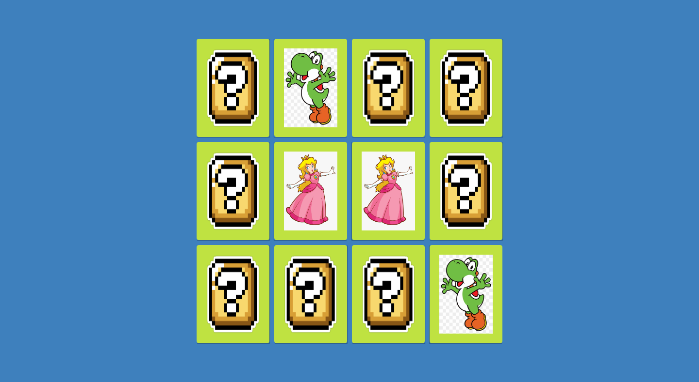

# Memory-Game

Creation of a memory game using only HTML, CSS, and Javascript.

With just a few lines of code, we've added 3D effects using CSS and implemented programming logic using conditionals, Immediately Invoked Function Expressions, and Array manipulation in a super fun project.

## Installation

1. Clone the repository: `git clone https://github.com/Burntroll/memory-game.git`
2. Navigate to the project directory: `cd memory-game`
3. Open the index.html file in your preferred browser.

Alternatively, you can play the game online by visiting the following link: <Im going to host on a website soon>

## Usage

This game was created for entertainment and to test your memory skills. The objective of the game is to match pairs of cards with the same image. Each turn, the player selects two cards and if they match, the cards stay face up. If they do not match, the cards are flipped back over and the player continues until all cards are matched.

## Technologies Used

- HTML
- CSS
- JavaScript

## Acknowledgements

- This game was inspired by classic memory games.

## License

This project is licensed under the [MIT License](https://opensource.org/licenses/MIT).

## Results

